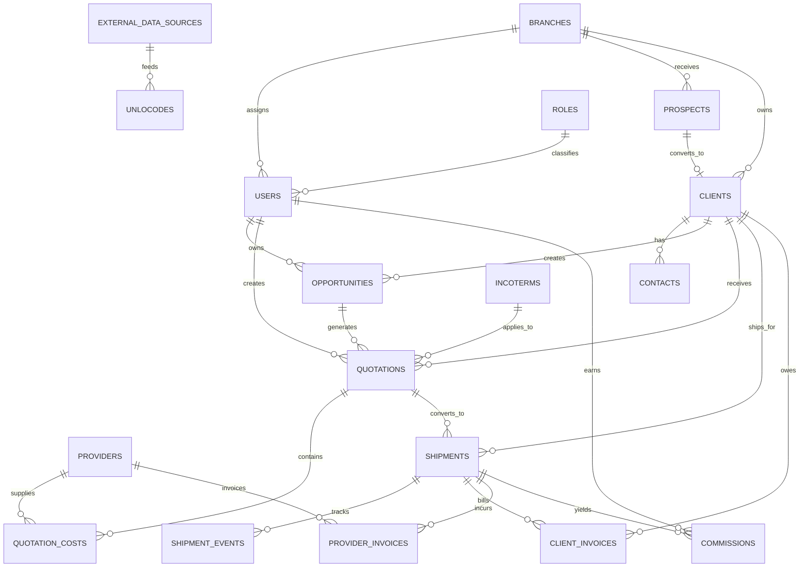

# AI DATABASE RELATION GRAPH

This document defines the canonical relational model for the Priority Logistics ERP.

It must remain synchronized with:

supabase/ERP_schema.sql

--------------------------------------------------
ERP BUSINESS MODEL
--------------------------------------------------

Primary revenue flow

Prospects
→ Clients
→ Opportunities
→ Quotations
→ Shipments
→ Client Invoices
→ Commissions

Operational support flow

Providers
→ Quotation Costs
→ Provider Invoices

--------------------------------------------------
MAIN ENTITY RELATIONSHIP DIAGRAM
--------------------------------------------------

--------------------------------------------------
FOREIGN KEY DEFINITIONS
--------------------------------------------------

users.role_id
references roles.id

users.branch_id
references branches.id

unlocodes.source_id
references external_data_sources.id

clients.city_unlocode
logically references unlocodes.unlocode

clients.city_unlocode_id
references unlocodes.id

providers.city_unlocode
logically references unlocodes.unlocode

providers.city_unlocode_id
references unlocodes.id

opportunities.origin_unlocode
logically references unlocodes.unlocode

opportunities.origin_unlocode_id
references unlocodes.id

opportunities.destination_unlocode
logically references unlocodes.unlocode

opportunities.destination_unlocode_id
references unlocodes.id

prospects.branch_id
references branches.id

clients.prospect_id
references prospects.id

clients.branch_id
references branches.id

contacts.client_id
references clients.id

client_logistics_parties.client_id
references clients.id

client_logistics_parties.city_unlocode_id
references unlocodes.id

provider_contacts.provider_id
references providers.id

provider_service_offerings.provider_id
references providers.id

provider_service_offerings.service_transport_type_id
references service_transport_types.id

opportunities.client_id
references clients.id

opportunities.salesperson_id
references users.id

quotations.client_id
references clients.id

quotations.opportunity_id
references opportunities.id

quotations.created_by
references users.id

quotations.incoterm_id
references incoterms.id

quotation_costs.quotation_id
references quotations.id

quotation_costs.provider_id
references providers.id

shipments.quotation_id
references quotations.id

shipments.client_id
references clients.id

shipment_events.shipment_id
references shipments.id

client_invoices.shipment_id
references shipments.id

client_invoices.client_id
references clients.id

provider_invoices.provider_id
references providers.id

provider_invoices.shipment_id
references shipments.id

commissions.shipment_id
references shipments.id

commissions.user_id
references users.id

--------------------------------------------------
DATABASE CREATION ORDER
--------------------------------------------------

1. branches
2. roles
3. external_data_sources
4. users
5. unlocodes
6. prospects
7. clients
8. contacts
9. providers
10. provider_contacts
11. provider_service_offerings
12. incoterms
13. opportunities
14. quotations
15. quotation_costs
16. shipments
17. shipment_events
18. client_invoices
19. provider_invoices
20. commissions
21. audit_logs
22. automation_logs

--------------------------------------------------
MODULE OWNERSHIP
--------------------------------------------------

MASTER DATA MODULE

external_data_sources
unlocodes
service_transport_types

CRM MODULE

branches
roles
users
prospects
clients
contacts

SALES MODULE

providers
provider_contacts
provider_service_offerings
opportunities
quotations
quotation_costs
incoterms

OPERATIONS MODULE

shipments
shipment_events

FINANCE MODULE

client_invoices
provider_invoices
commissions

OBSERVABILITY MODULE

audit_logs
automation_logs

--------------------------------------------------
AUTOMATION DEPENDENCIES
--------------------------------------------------

Quotation Approved
→ create shipment

Shipment status updated
→ reflected in shipment activity views

Insert / update / delete on core commercial tables
→ write audit log entries

--------------------------------------------------
INTEGRITY RULES
--------------------------------------------------

1. The client lifecycle starts with prospects and only then becomes clients.
2. A quotation must always belong to both a client and an opportunity.
3. A shipment must always belong to a quotation and a client.
4. Client invoices must reference the billed client.
5. Provider invoices must reference the billed provider.
6. Commissions must always reference a shipment and a user.
7. Any new relationship must be added to this graph and the table dictionary in the same change.
8. External public datasets must define provenance through external_data_sources.
